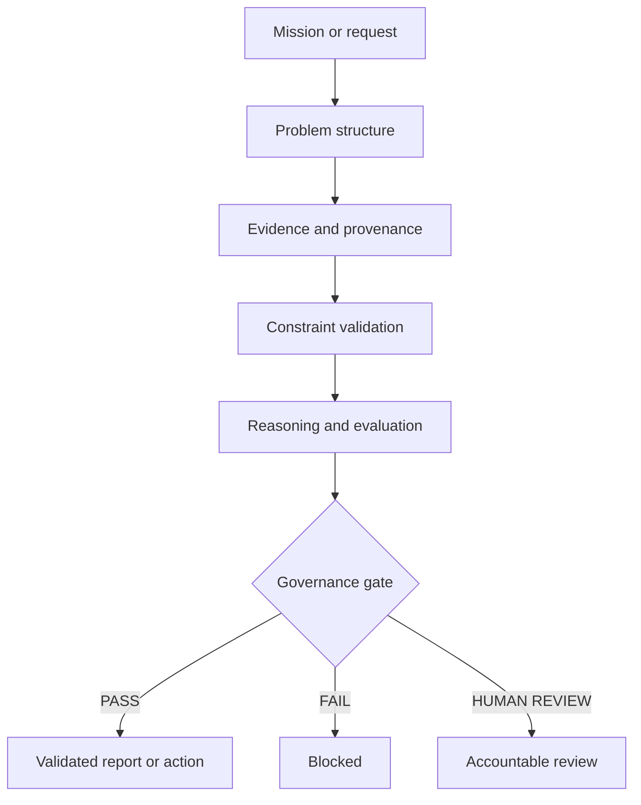

# Reliable Intelligence Framework (RIF)

> **Building trustworthy AI systems — not just powerful ones.**

## The reliability layer for AI-assisted decisions

Large language models can produce persuasive answers while blending facts, assumptions, outdated evidence, uncertainty, and unsupported conclusions with equal confidence.

The enterprise challenge is therefore no longer just:

> *Can the model generate an answer?*

It is:

> **Should this answer be trusted — and is the system allowed to act on it?**

The **Reliable Intelligence Framework (RIF)** is an architectural concept for adding evidence validation, constraint enforcement, governance, and traceability to AI-assisted workflows before outputs influence business decisions or trigger actions.

---

## What RIF introduces

RIF is designed to make AI systems:

- **Evidence-aware** — material claims are linked to appropriate and traceable evidence.
- **Constraint-driven** — hard rules are evaluated before recommendations or actions.
- **Epistemically explicit** — facts, assumptions, claims, uncertainty, and open issues remain distinguishable.
- **Governable** — validated state and defined gates control outcomes.
- **Human-reviewable** — material ambiguity and risk are routed to accountable reviewers.
- **Auditable** — decisions can be reconstructed from structured records.
- **Benchmarkable** — reliability can be tested against defined failure classes and mission cases.

RIF does not attempt to make AI infallible. It makes AI outputs and actions **inspectable, governable, and challengeable**.

## Core operating principle

> **Prose is presentation. Structured, validated state is the truth layer.**

A simplified RIF flow:

The language model may support analysis, but it is not the final authority. High-impact outcomes depend on validated state, deterministic constraints, documented thresholds, and escalation rules.

## Guiding principles

1. Evidence before certainty.
2. Hard constraints first.
3. Facts, assumptions, and claims remain separate.
4. Structured state before narrative.
5. Human review is a feature, not a failure.
6. Confidence must be calibrated.
7. Traceability comes before elegance.

---

## Reliable Reasoning Standards (RRS)

The **Reliable Reasoning Standards (RRS)** are an evolving standards initiative accompanying RIF. Their purpose is to provide technology-agnostic terminology, requirements, assessment dimensions, benchmarks, governance patterns, and decision-assurance mechanisms for reasoning systems.

The work currently covers areas including:

- failure classes and remediation patterns,
- evidence quality and epistemic discipline,
- logical and constraint consistency,
- governance and human oversight,
- reliability metrics and scoring,
- benchmark missions and test protocols,
- traceability and decision assurance,
- reference architecture and conformance concepts.

RIF and RRS serve different roles:

| RIF | RRS |
|---|---|
| Architectural and implementation-oriented framework | Technology-agnostic standards initiative |
| Organizes validation, governance, and execution | Defines terminology, requirements, tests, and assessment |
| Produces governed decision artifacts | Enables comparable reliability evaluation |

**Important:** The materials described here are under active development. This repository does **not** claim formal RRS conformance or certification.

---

## Where RIF can add value

RIF is intended for AI-assisted processes in which plausible but unsupported output can create financial, legal, operational, safety, or reputational consequences.

Examples include:

- enterprise research and decision support,
- regulated or compliance-sensitive workflows,
- sales quotations and commercial approvals,
- procurement and supplier assessment,
- document and multimodal evidence analysis,
- agentic systems that use tools or execute actions,
- executive reporting based on multiple sources.

## Public repository scope

This repository is a public orientation layer for the initiative.

It may progressively include:

- project positioning and terminology,
- selected architectural concepts,
- public diagrams and explanatory material,
- non-sensitive roadmap information,
- discussion drafts and selected specifications,
- selected reference examples.

It intentionally excludes:

- proprietary production implementations,
- complete benchmark corpora,
- internal governance logic and prompts,
- customer-specific material,
- security-sensitive execution controls,
- unpublished research and commercial IP.

This boundary is deliberate: the public material should make the initiative understandable and discussable without publishing the complete implementation and assurance stack.

## Development focus

Current work includes:

- deterministic evidence validation,
- agent and execution governance,
- decision assurance and auditability,
- benchmark-driven reliability testing,
- multimodal evidence handling,
- report-integrity validation,
- reliable AI execution patterns.

## Project status

RIF and RRS are under active development. Public documentation will be released progressively when individual components are sufficiently mature, internally consistent, and suitable for external review.

Feedback from AI architects, governance professionals, enterprise practitioners, researchers, and standards experts is welcome.

## Vision

Most of the AI race focuses on building more capable models.

This initiative focuses on the layer around them:

> **Systems that can show why an output is supported, when it must be challenged, and whether it is permitted to influence a decision.**

## Author

**Wernher von Schrader**  
Creator of the Reliable Intelligence Framework (RIF) and initiator of the Reliable Reasoning Standards (RRS).

## Rights and use

Copyright © 2026 Wernher von Schrader.

Unless a file states otherwise, no license for reuse, modification, redistribution, certification, or commercial implementation is granted. Selected materials may be released under separate licenses in the future.

---

**Document status:** Public overview · Version 1.0 · 20 July 2026  
**Source basis:** RIF v3.4 RC2 and RRS v0.3 freeze  
**Changelog:** Replaced the repository placeholder with a public standards-initiative overview; clarified scope, maturity, architecture, and rights.
